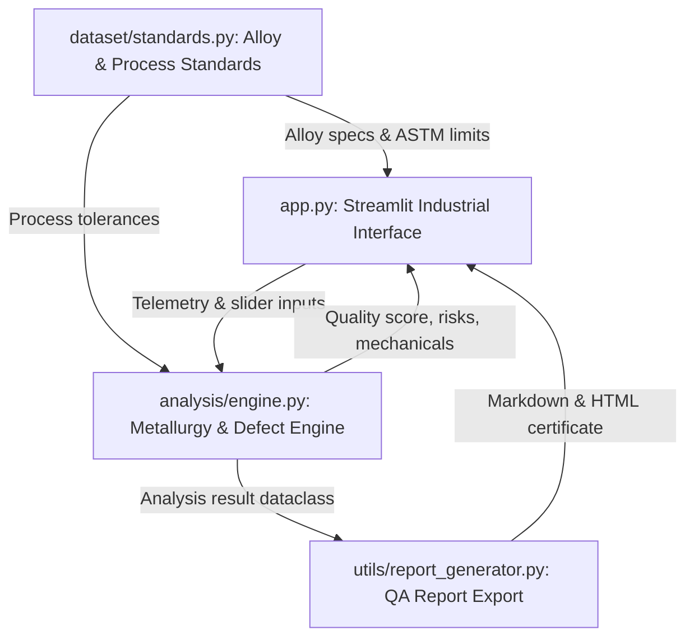

# AluSense AI™ — Aluminium Manufacturing Quality Intelligence Platform

[](https://streamlit.io/cloud)
[](https://www.python.org/)
[](LICENSE)
[](#standards--calibration)

> **AI-assisted aluminium manufacturing quality intelligence platform.** Real-time physics-guided parameter validation, multi-hazard defect prediction, and ASTM/ISO standard compliance verification for mission-critical additive manufacturing and precision casting.

---

## 1. Problem Statement
High-integrity additive manufacturing (LPBF, DMLS, WAAM) and advanced casting of aluminium alloys (e.g. AlSi10Mg, Scalmalloy®, Al 6061-RAM2) involve highly sensitive, non-linear thermal dynamics. 
- **Thermal Mismatch & Defect Formation**: Minor deviations in volumetric energy density, scan velocity, or chamber atmosphere result in catastrophic defects such as **keyholing gas porosity**, **lack-of-fusion voids**, and **alumina bifilms**.
- **Delayed Quality Feedback**: Traditional post-build inspection (X-ray CT scanning, Archimedes density testing, tensile coupons) takes days or weeks, causing massive material waste and scrap costs.
- **Strict Compliance Demands**: Aerospace and automotive flight standards (ISO/ASTM 52900, ASTM F3055, AMS 4999) mandate exhaustive parameter tolerance auditing.

---

## 2. Solution: AluSense AI™
**AluSense AI™** is a commercial-grade quality intelligence platform that bridges metallurgical constitutive equations, physics-guided defect models, and real-time process monitoring into an intuitive, decision-oriented interface.

```
Input Parameters ───► Engineering Analysis ───► Quality Decision ───► Actionable Recommendations
 (Preheat, VED,       (ISO/ASTM Verification,    (Quality Score %,       (Closed-Loop Tuning,
  Speed, Oxygen)       Melt Pool Map, Risks)       Optimal/Critical)       Audit Report Export)
```

---

## 3. Core Features
- **3-Level Industrial UX**:
  - **Level 1 (Decision View)**: Prominent Quality Score (0–100%), Process Health Condition (`OPTIMAL`, `ACCEPTABLE`, `CRITICAL`), in-spec parameter count, and executive engineering directive.
  - **Level 2 (Engineering Analysis)**: Parameter telemetry, tolerance boundary validation table, actionable defect risk cards, predicted mechanical properties, and 2D melt pool regime map.
  - **Level 3 (Detailed Specifications)**: Alloy chemical composition card, thermophysical material properties table, and official QA inspection report exports.
- **Physical Metallurgy Analysis Engine**:
  - Volumetric Energy Density (VED) constitutive modeling ($VED = \frac{P}{v \cdot h \cdot t}$).
  - Multi-variable tolerance deviation scoring with sensitivity weighting.
- **Actionable Defect Hazard Modeling**:
  - Quantitative probability assessment for **Keyholing & Evaporation Porosity**, **Lack of Fusion (LoF)**, **Atmospheric Oxidation**, and **Residual Stress & Warpage**.
  - Direct root-cause diagnosis paired with parameter tuning directives.
- **Constitutive Mechanical Property Prediction**:
  - Real-time estimates for Yield Strength ($R_{p0.2}$ MPa), Ultimate Tensile Strength (UTS MPa), Plastic Elongation (%), and Relative Density (%).
- **Formal QA Audit Report Generation**:
  - One-click export of cryptographically stamped inspection documents in **Markdown (`.md`)** and **Printable HTML (`.html`)**.

---

## 4. System Architecture
The application follows a clean, modular industrial architecture:



### Directory Structure
```
AluSense_AI/
├── app.py                      # Main Streamlit application & layout
├── analysis/
│   ├── __init__.py
│   └── engine.py               # Metallurgy analysis, defect models & mechanical predictions
├── dataset/
│   ├── __init__.py
│   └── standards.py            # ISO/ASTM 52900, ASTM F3055 alloy specs & presets
├── utils/
│   ├── __init__.py
│   └── report_generator.py     # Markdown audit and printable HTML certificate generator
├── requirements.txt            # Production dependencies
├── .gitignore                  # Git repository exclusion rules
└── README.md                   # Project documentation
```

---

## 5. Technology Stack
- **Application Framework**: [Streamlit](https://streamlit.io/) (v1.30+)
- **Data & Numerical Core**: [Pandas](https://pandas.pydata.org/), [NumPy](https://numpy.org/)
- **Industrial Visualizations**: [Plotly](https://plotly.com/python/) (High-contrast technical styling)
- **Styling**: Vanilla CSS, Modern Typography (`Plus Jakarta Sans`, `JetBrains Mono`)
- **Deployment Platform**: Streamlit Community Cloud (Linux / Docker)

---

## 6. Supported Alloys & Processes

| Alloy Grade | Standard Specification | Primary Process Compatibility | Key Industrial Applications |
| :--- | :--- | :--- | :--- |
| **AlSi10Mg** | ASTM F3055 / DIN EN 1706 | LPBF, DMLS | Aerospace heat exchangers, brackets |
| **Scalmalloy®** | AMS 4999 / ISO/ASTM 52900 | LPBF | Formula 1, rocket turbopumps, satellites |
| **Al 6061-RAM2** | ASTM B221 / AMS 4027 Mod | LPBF, WAAM | Marine structural frames, avionics bays |
| **Al 7075-AM** | AMS 4045 / ASTM B209 Mod | LPBF | High-stress kinetic linkages, airframes |
| **A356-T6** | ASTM B618 / AMS 4218 | WAAM, HPDC | Automotive uprights, large pressure preforms |

---

## 7. Demo Walkthrough & Screenshots

### Dashboard Operational View
```
┌────────────────────────────────────────────────────────────────────────────────────────┐
│ AluSense AI™ | Aluminium Manufacturing Intelligence Platform       ● Online  [DEMO]    │
├────────────────────────────────────────────────────────────────────────────────────────┤
│ PROCESS HEALTH: 81.3%  [ACCEPTABLE]   5/6 in-spec   Directive: Regulate preheat to 200°C│
├──────────────────────────────┬─────────────────────────────────────────────────────────┤
│ [Process Parameters]         │ [Defect Risk Analysis]                                  │
│ • Build Plate Preheat: 200°C │ • Keyholing Porosity: 3.0% (LOW RISK)                   │
│ • Energy Density: 62.0 J/mm³ │ • Lack of Fusion: 3.0% (LOW RISK)                       │
│ • Scan Speed: 1300 mm/s      │ • Atmospheric Oxidation: 12.8% (LOW RISK)               │
│ • Chamber O2: 45 ppm         │ • Residual Stress: 4.0% (LOW RISK)                      │
│                              ├─────────────────────────────────────────────────────────┤
│ [Parameter Validation]       │ [Melt Pool Processing Window (2D Regime Map)]           │
│ Measured vs ASTM Boundaries  │ Safe Conduction Envelope vs Keyhole/LoF regimes         │
└──────────────────────────────┴─────────────────────────────────────────────────────────┘
```

---

## 8. Local Installation Instructions

### Prerequisites
- Python 3.10, 3.11, or 3.12
- Git

### Quickstart
```bash
# 1. Clone repository
git clone https://github.com/your-username/AluSense_AI.git
cd AluSense_AI

# 2. Create virtual environment
python -m venv .venv

# Activate on Windows:
.venv\Scripts\activate
# Activate on macOS/Linux:
source .venv/bin/activate

# 3. Install dependencies
pip install -r requirements.txt

# 4. Launch application
streamlit run app.py
```
Open **`http://localhost:8501`** in your browser.

---

## 9. Free Public Deployment on Streamlit Community Cloud

Deploy **AluSense AI™** publicly in under 2 minutes:

1. **Push to GitHub**:
   ```bash
   git init
   git add .
   git commit -m "feat: initial release of AluSense AI"
   git branch -M main
   git remote add origin https://github.com/<your-username>/<your-repo-name>.git
   git push -u origin main
   ```

2. **Deploy on Streamlit Community Cloud**:
   - Navigate to [share.streamlit.io](https://share.streamlit.io/).
   - Sign in with your GitHub account.
   - Click **"New app"**.
   - Select your repository: `<your-username>/<your-repo-name>`.
   - Branch: `main`.
   - Main file path: `app.py`.
   - Click **"Deploy!"**.

Streamlit will automatically install dependencies from `requirements.txt` and launch your live public application.

---

## 10. License
This project is licensed under the [MIT License](LICENSE).
